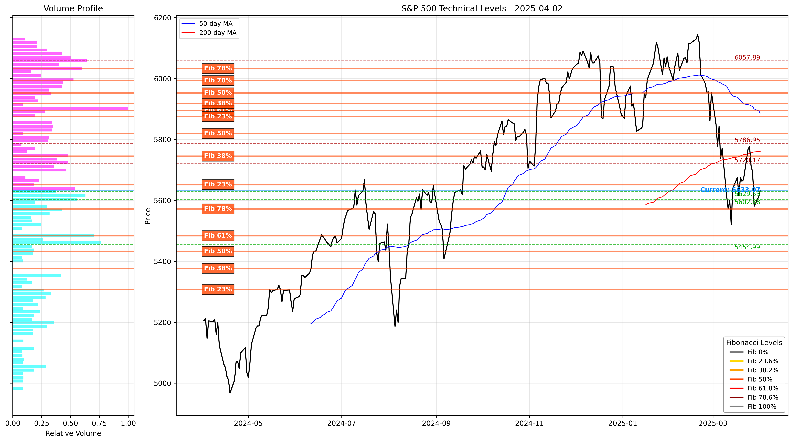

# SPX Levels

A modular Python package for advanced technical analysis of stock and index price levels.



## Overview

SPX Levels is a comprehensive tool for identifying key technical levels in financial markets. It combines multiple technical analysis methodologies into a unified framework that produces actionable support and resistance levels.

### Features

- **Multi-Method Technical Analysis**:
  - Volume Profile Analysis
  - Fibonacci Retracements (with color-coded visualization)
  - Moving Averages (50-day, 200-day)
  - Price Action Support/Resistance
  - Psychological Round Numbers
  - VIX (Volatility) Analysis

- **Consolidated Level Identification**:
  - Combines multiple technical factors to find the most significant levels
  - Ranks levels by strength (number of confluent factors)
  - Groups nearby levels to reduce noise

- **Comprehensive Output**:
  - Text report with detailed level information
  - Chart visualization with volume profile
  - Color-coded Fibonacci levels with percentage labels
  - Support and resistance levels displayed with strength indicators
  - Swing points analysis for Fibonacci calculations

## Installation

### From Source

1. Clone the repository:
   ```bash
   git clone https://github.com/yourusername/spx-levels.git
   cd spx-levels
   ```

2. Install the package and dependencies:
   ```bash
   pip install -e .
   ```

### Dependencies

- pandas>=1.3.0
- numpy>=1.20.0
- yfinance>=0.1.70
- matplotlib>=3.4.0
- scipy>=1.7.0

## Usage

### Command Line

```bash
# Basic usage (analyzes S&P 500 with 1-year of data)
spx-levels

# Analyze a specific ticker
spx-levels --ticker="AAPL"

# Change time period
spx-levels --period="6mo"

# Specify output folder
spx-levels --output="my_analysis"

# Disable VIX analysis
spx-levels --no-vix

# Don't display chart (just save to file)
spx-levels --no-plot
```

### Python API

```python
from spx_levels.main import analyze_market

# Simple usage
analyze_market(ticker="^GSPC", period="1y")

# More options
results = analyze_market(
    ticker="AAPL",
    period="6mo",
    include_vix=True,
    plot=True,
    output_folder="apple_analysis"
)
```

### Advanced Usage

For more control over the analysis process, you can use the individual components:

```python
from spx_levels.data import MarketData
from spx_levels.analysis import PriceAction, FibonacciAnalysis, VolumeAnalysis
from spx_levels.levels import TechnicalLevels, PsychologicalLevels
from spx_levels.visualization import ChartGenerator

# See examples/simple_analysis.py for a complete example
```

## Output Files

The package generates three output files:

1. **Technical Levels Report** (`TICKER_levels_DATE.txt`):
   ```
   Technical Levels Report - 2025-04-02
   Current Price: 5633.06

   VIX Analysis: VIX below 20-day average - favorable for upside targets.

   Resistance Levels:
   5660.00 **** - Round number (100s), Fibonacci 78.6% (Fib_Up_2)
   5645.00 *** - Previous swing high, Round number (50s)
   5635.00 *** - Target level (needs lower VIX), Fibonacci 61.8% (Fib_Up_1)
   5600.00 ***** - Key level (round number + high volume), Volume cluster

   Support Levels:
   5577.00 **** - Stronger support (previous consolidation), Volume cluster
   5550.00 **** - Support (round number + volume), MA_50 support/resistance
   5524.00 *** - Support (previous consolidation)
   5515.00 *** - Support (Fibonacci 50%), Recent price action
   5504.00 ***** - Key support (major swing low + volume), Volume cluster
   5480.00 ** - Support (Fibonacci 61.8%)

   Strength Indicator: * (weak) to ***** (very strong)
   ```

2. **Swing Points Analysis** (`TICKER_swing_points_DATE.txt`):
   ```
   Swing Points Analysis - 2025-04-02
   ============================================================

   SWING HIGHS (used for Fibonacci calculations)
   ------------------------------------------------------------
   2025-03-15: 5750.25
   2025-02-20: 6120.45
   2025-01-10: 6150.80
   ...

   SWING LOWS (used for Fibonacci calculations)
   ------------------------------------------------------------
   2025-03-25: 5480.15
   2025-02-05: 5700.30
   2025-01-03: 5550.60
   ...

   Note: Fibonacci retracements are calculated using combinations
   of these swing highs and lows, prioritizing recent swings.
   ```

3. **Technical Chart** (`TICKER_chart_DATE.png`):
   - Price chart with moving averages
   - Volume profile on left side
   - Support and resistance levels with labels
   - Color-coded Fibonacci retracement levels
   - Current price marker

## Analysis Methodology

### Level Calculation

1. **Volume Profile**:
   - Analyzes price zones with highest trading volume
   - More trading activity = stronger support/resistance

2. **Fibonacci Retracements**:
   - Calculates standard Fibonacci levels (23.6%, 38.2%, 50%, 61.8%, 78.6%)
   - Uses multiple swing high/low pairs for redundancy
   - Visually distinguishes Fibonacci levels with color-coding by percentage
   - Labels each level directly on the chart

3. **Moving Averages**:
   - 50-day and 200-day moving averages as dynamic support/resistance

4. **Price Action Analysis**:
   - Identifies significant swing points from recent history
   - Finds local support/resistance from recent price behavior

5. **Psychological Levels**:
   - Round numbers (5600, 5550, etc.)
   - Quarter levels (5525, 5575, etc.) near current price

6. **VIX Analysis**:
   - Compares current VIX (volatility index) value to its 20-day moving average
   - Provides context on market volatility conditions
   - When VIX is below its 20-day average: Indicates decreasing volatility, favorable for upside targets
   - When VIX is above its 20-day average: Indicates elevated volatility, may need to decrease for upside price targets
   - Helps determine the likelihood of breaking support or reaching resistance levels
   - Integrates volatility context with price levels for more comprehensive analysis

### Level Strength Assessment

Levels are ranked by the number of technical factors that converge on that price point:
- Volume clusters get extra weight
- Price action levels get extra weight
- Multiple Fibonacci confluences get extra weight

## Project Structure

```
spx_levels/
│
├── README.md                 # Project documentation
├── setup.py                  # Package installation script
├── requirements.txt          # Dependencies
│
├── spx_levels/              # Main package
│   ├── __init__.py           # Package initialization
│   ├── main.py               # Entry point with CLI handling
│   │
│   ├── data/                 # Data handling
│   │   ├── __init__.py
│   │   └── market_data.py    # Data fetching and preparation
│   │
│   ├── analysis/             # Technical analysis components
│   │   ├── __init__.py
│   │   ├── fibonacci.py      # Fibonacci calculations
│   │   ├── volume.py         # Volume profile analysis
│   │   ├── price_action.py   # Price action analysis (swings, support/resistance)
│   │   ├── moving_averages.py # Moving average calculations
│   │   └── volatility.py     # VIX and volatility analysis
│   │
│   ├── levels/               # Level identification
│   │   ├── __init__.py
│   │   ├── technical_levels.py # Main level identification
│   │   ├── psychological.py  # Psychological levels
│   │   └── strength.py       # Level strength calculation
│   │
│   ├── visualization/        # Visualization components
│   │   ├── __init__.py
│   │   ├── charts.py         # Chart generation
│   │   └── styling.py        # Visual styling settings
│   │
│   └── output/               # Output formatting
│       ├── __init__.py
│       ├── text_output.py    # Text report generation
│       └── file_output.py    # File output handling
│
├── examples/                 # Example scripts
│   └── simple_analysis.py    # Basic usage example
│
└── outputs/                  # Default output directory
```

## Contributing

Contributions are welcome! Please feel free to submit a Pull Request.

## License

This project is licensed under the MIT License - see the LICENSE file for details.

## Disclaimer

This tool is for informational purposes only. It is not financial advice, and no investment decisions should be made based solely on its outputs. Trading involves risk, and past performance is not indicative of future results.